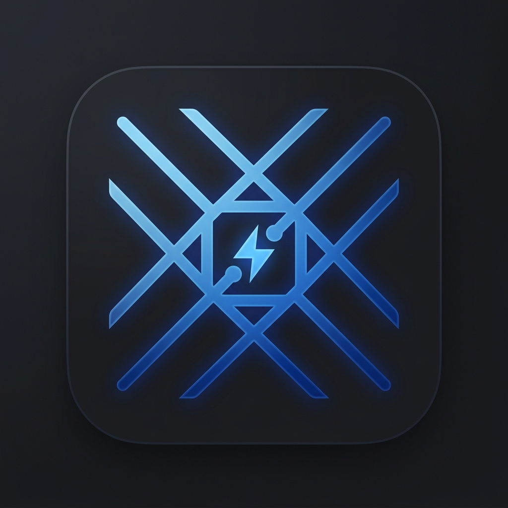

# GridSight - Energy Intelligence Platform

<div align="center">
  
  <h3>Professional-Grade Grid Monitoring & Telemetry Analytics</h3>
</div>

---

**GridSight** is a premium desktop application engineered for energy grid operators, offering real-time monitoring of power plants, substations, and transmission networks. 

Originally built as a web-based React application, GridSight has been seamlessly evolved into a highly integrated, cross-platform Electron desktop application. This transition provides native OS capabilities, secure IPC data streaming, and hardware-accelerated telemetry rendering—all while preserving the original highly-optimized, **shared React frontend UI**.

> ⚠️ **Note Regarding Confidentiality:**
> The proprietary backend infrastructure—including the real-time telemetry streaming engines, historical analysis databases, and alert correlation servers—has been **removed from this repository** as it constitutes confidential internal IP.
>
> To demonstrate the frontend analytics, shared UI architecture, and IPC integration without compromising sensitive backend systems, the application currently ships with an offline, localized mock telemetry dataset.

---

## 🎨 The Shared UI Architecture

A core architectural principle of GridSight is the **Shared UI**. There is only one React codebase powering both the web and desktop experiences. 

The UI intelligently adapts based on its execution environment:
- **In the Browser:** Utilizes the `BrowserDatasetRepository`, relying strictly on web APIs to render mock data or connect to standard web sockets.
- **In Electron:** Detects the secure `contextBridge` (`window.gridSight`) and switches to the `ElectronDatasetRepository`. This unlocks native capabilities: directly parsing local filesystem datasets, emitting OS-level notifications, and rendering custom native window controls (Minimize, Maximize, Close) inside the React DOM.

### Design System
GridSight features a dark-mode-first, minimalist aesthetic inspired by premium engineering tools (e.g., Apple, Linear). It deliberately avoids standard "web wrapper" paradigms by implementing:
- Frameless native windows (`frame: false`)
- Draggable interface headers (`-webkit-app-region: drag`)
- Highly optimized typography, subtle glassmorphism, and purpose-driven micro-animations.

---

## ⚡ Key Features

### 1. Network Explorer
A high-performance data grid providing a comprehensive view of all connected energy assets. Displays real-time health scores, load percentages, and operational statuses (Online, Warning, Critical) utilizing color-coded dynamic indicators.

### 2. Telemetry Analysis Dashboard
A professional visualization workspace powered by Recharts. It features dynamic metrics (Average Load, Peak Load, Thermal Stress) and multi-axis charts comparing historical telemetry data (voltage, temperature, vibration) across multiple assets simultaneously.

### 3. Unified Command Palette
Accessible globally via `⌘/Ctrl + K`, the command palette provides immediate, keyboard-first navigation and contextual actions without needing to touch the mouse.

### 4. Live Activity Stream (Alerts)
A chronological feed of system events, warnings, and maintenance notices. Employs pulse animations for live data tracking and visual hierarchy to prioritize critical hardware anomalies.

---

## 🛠 Tech Stack

- **Core Frontend:** React 19, TypeScript
- **State Management:** Zustand
- **Build Tooling:** Vite 8 (Hot Module Replacement)
- **Desktop Environment:** Electron 44
- **Styling:** CSS3 (Custom Design System, variables, animations)
- **Icons:** Lucide React
- **Charts:** Recharts

---

## 🚀 Getting Started

### Prerequisites
- Node.js v18 or higher
- npm or yarn

### Installation

Clone the repository and install dependencies:
```bash
npm install
```

### Development Mode

To launch the application in development mode (which concurrently starts the Vite hot-reloading server and the Electron native wrapper):
```bash
npm run electron:dev
```

### Production Build & Packaging

GridSight uses `electron-builder` to package native executables tailored to your operating system. The process automatically compiles the TypeScript backend, bundles the Vite frontend, and builds the application binary.

```bash
npm run electron:build
```

The compiled applications (e.g., `.dmg` for macOS, `.exe` for Windows, or `.AppImage` for Linux) will be automatically output to the `/release` directory, fully equipped with the custom GridSight icon.
